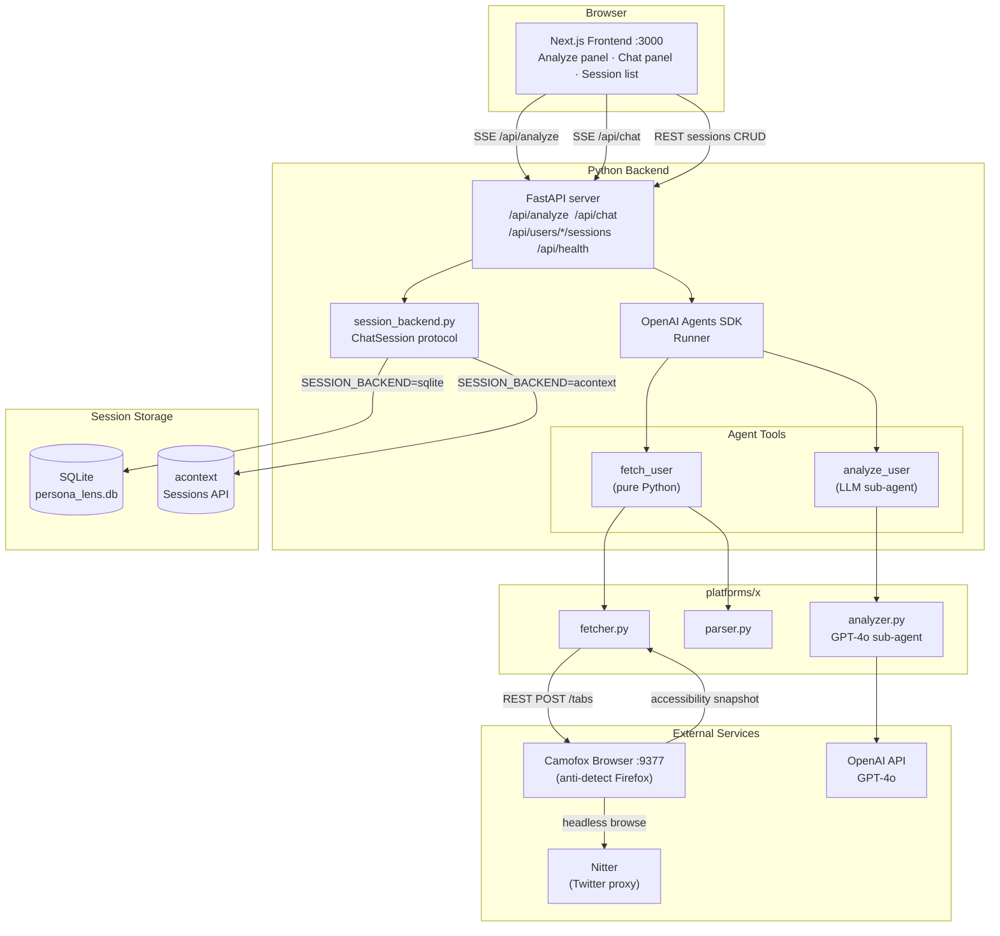

# persona-lens

Interactive AI agent for analyzing X (Twitter) KOL (Key Opinion Leader) profiles through conversation.

Available as a **web app** (FastAPI + Next.js) or a **CLI tool**.

## How it works

1. Enter an X/Twitter username and click Analyze (or ask the agent directly)
2. The agent fetches tweets via Nitter using [Camofox Browser](https://github.com/jo-inc/camofox-browser) (anti-detection Firefox automation)
3. Tweets are parsed into structured data — text, engagement stats, media, timestamps (decoded from Twitter snowflake IDs)
4. A profile analyzer (GPT-4o) extracts products mentioned, writing style, and engagement insights
5. Ask follow-up questions in the chat panel — the agent reuses cached data without re-fetching

## Requirements

- Python 3.13+
- Node.js (for Camofox Browser and frontend)
- `uv` package manager
- OpenAI API key

## Setup

### 1. Start Camofox Browser

```bash
git clone https://github.com/jo-inc/camofox-browser
cd camofox-browser
npm install
npm start
```

The service starts on port 9377 and downloads Camoufox (~300MB) on first run.

Or use Docker:

```bash
docker build -t camofox-browser .
docker run -p 9377:9377 camofox-browser
```

### 2. Install persona-lens

```bash
uv sync
```

### 3. Configure environment

```bash
cp .env.example .env
# Edit .env — at minimum set OPENAI_API_KEY
```

## Usage

### Web app (recommended)

```bash
# Terminal 1 — API server
uv run uvicorn persona_lens.api.server:app --reload

# Terminal 2 — frontend
cd frontend
npm install
npm run dev
```

Open http://localhost:3000.

### CLI

```bash
# Start the interactive agent
uv run persona-lens

# Fetch more tweets per account (default: 30)
uv run persona-lens --tweets 50
```

### Example session

```
You: Analyze @karpathy and @sama
  → Fetching @karpathy...
  → Analyzing @karpathy...
  → Fetching @sama...
  → Analyzing @sama...

Agent: Here's what I found...

You: Which one mentions more AI coding tools?
Agent: (answers from cached data — no re-fetching)
```

### What the agent extracts per account

- **Profile info** — bio, followers, following, tweet count
- **Products mentioned** — with AI-inferred categories
- **Writing style** — tone, vocabulary, format preferences
- **Engagement insights** — top posts and what drives engagement
- **Posting patterns** — peak days and hours (UTC)

## Architecture



### File map

```
persona_lens/
  agent/
    cli.py              — Typer CLI entry point
    loop.py             — Interactive agent loop (OpenAI Agents SDK)
      ├─ fetch_user     — tool: fetch snapshot → parse → compute patterns
      └─ analyze_user   — tool: run profile analyzer sub-agent
  api/
    server.py           — FastAPI server (SSE streaming, session & profile CRUD)
    session_backend.py  — Swappable chat-history store (SQLite or acontext)
  platforms/x/
    fetcher.py          — Camofox Browser REST API → Nitter page
    parser.py           — snapshot → structured tweets + user info
    analyzer.py         — GPT-4o sub-agent → products, style, engagement
  utils/
    patterns.py         — tweet timestamps → posting patterns

frontend/
  app/page.tsx          — main page (analyze + chat layout)
  components/           — profile card, chat panel, posting heatmap, …
  hooks/
    use-analysis.ts     — SSE streaming for /api/analyze
    use-chat.ts         — SSE streaming for /api/chat, loads history on mount
    use-session-manager.ts — create / rename / delete sessions
```

## Session backends

Chat history can be stored in two backends, toggled via `SESSION_BACKEND`:

| Backend | Storage | Setup |
|---------|---------|-------|
| `sqlite` (default) | Local `persona_lens.db` | No extra config |
| `acontext` | [acontext](https://acontext.app) Sessions API | Requires `ACONTEXT_API_KEY` |

## Environment variables

| Variable | Default | Description |
|----------|---------|-------------|
| `OPENAI_API_KEY` | — | Required |
| `CAMOFOX_URL` | `http://localhost:9377` | Camofox Browser API URL |
| `NITTER_INSTANCE` | `https://nitter.net` | Nitter instance. If unset, auto-detects from the [LibreRedirect list](https://github.com/libredirect/instances) |
| `SESSION_BACKEND` | `sqlite` | Chat history backend: `sqlite` or `acontext` |
| `ACONTEXT_API_KEY` | — | Required when `SESSION_BACKEND=acontext` |
| `ACONTEXT_BASE_URL` | hosted default | Optional: self-hosted acontext instance URL |
| `DB_PATH` | `persona_lens.db` | SQLite database path |

## Limitations

**Tweet cap:** Nitter uses Twitter's unauthenticated guest token API, which limits how far back the timeline can be paginated. The exact number varies by Nitter instance and token pool health.

## License

MIT © [jinjiaKarl](https://github.com/jinjiaKarl)
