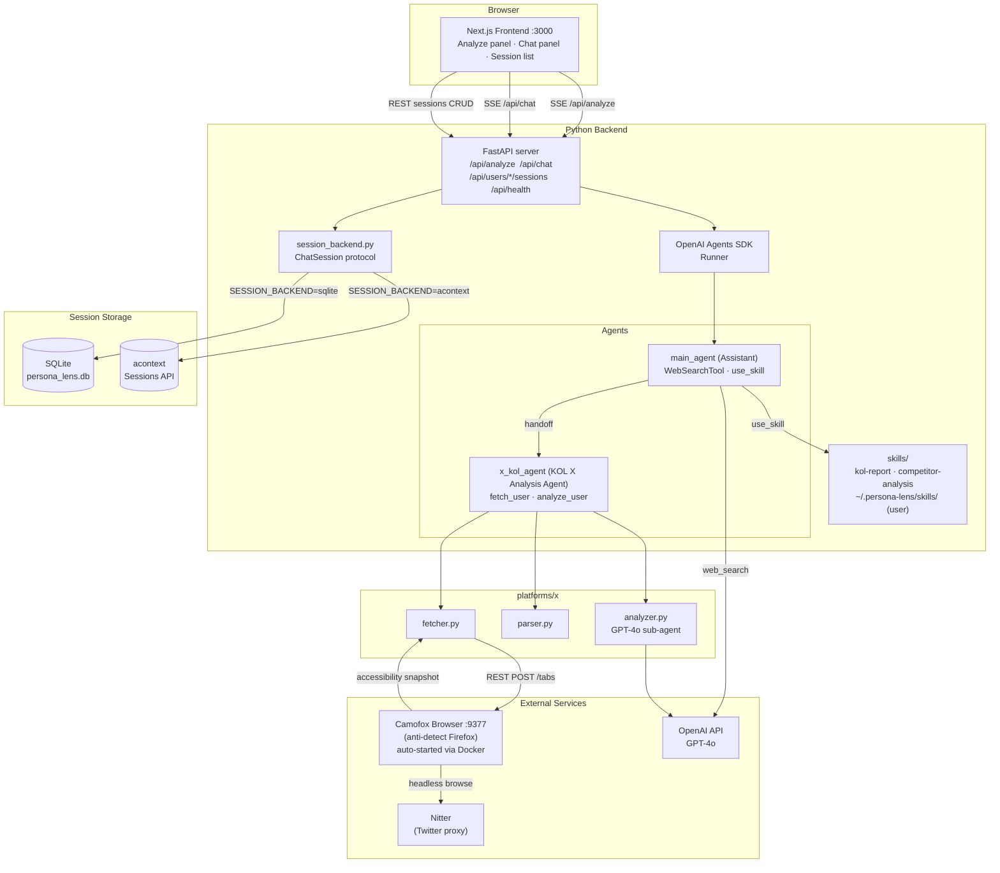

# persona-lens

Interactive AI agent for analyzing X (Twitter) KOL (Key Opinion Leader) profiles through conversation.

Available as a **web app** (FastAPI + Next.js) or a **CLI tool**.

## How it works

1. Enter an X/Twitter username and ask the agent to analyze it (CLI or web)
2. The **main agent** delegates to the **KOL X Analysis Agent** via handoff
3. The specialist agent fetches tweets via Nitter using [Camofox Browser](https://github.com/jo-inc/camofox-browser) (anti-detection Firefox automation)
4. Tweets are parsed into structured data — text, engagement stats, media, timestamps (decoded from Twitter snowflake IDs)
5. A profile analyzer (GPT-4o) extracts products mentioned, writing style, and engagement insights
6. Ask follow-up questions — the agent reuses cached data without re-fetching
7. Request a formatted report with a **skill** (e.g. "give me a KOL report")

## Requirements

- Python 3.13+
- Node.js (for Camofox Browser and frontend)
- `uv` package manager
- OpenAI API key
- Docker (optional — auto-starts Camofox Browser if image is available)

## Setup

### 1. Build Camofox Browser Docker image

```bash
git clone https://github.com/jo-inc/camofox-browser
cd camofox-browser
docker build -t camofox-browser .
```

The CLI and API server will automatically start/stop the container. Alternatively, run it manually:

```bash
docker run -p 9377:9377 camofox-browser
```

The service starts on port 9377 and downloads Camoufox (~300MB) on first run.

### 2. Install persona-lens

```bash
uv sync
```

### 3. Configure environment

```bash
cp .env.example .env
# Edit .env — at minimum set OPENAI_API_KEY
```

## Usage

### Web app (recommended)

```bash
# Start both backend and frontend together
./dev.sh
```

Or separately:

```bash
# Terminal 1 — API server
uv run uvicorn persona_lens.api.server:app --reload --port 8000

# Terminal 2 — frontend
cd frontend
npm install
npm run dev
```

Open http://localhost:3000.

### CLI

```bash
# Start the interactive agent
uv run persona-lens

# Fetch more tweets per account (default: 30)
uv run persona-lens --tweets 50
```

### Example session

```
You: Analyze @karpathy and @sama
  → Fetching @karpathy...
  → Analyzing @karpathy...
  → Fetching @sama...
  → Analyzing @sama...

Agent: Here's what I found...

You: Which one mentions more AI coding tools?
Agent: (answers from cached data — no re-fetching)

You: Give me a KOL report
Agent: (loads kol-report skill and formats a structured report)
```

### What the agent extracts per account

- **Profile info** — bio, followers, following, tweet count
- **Products mentioned** — with AI-inferred categories
- **Writing style** — tone, vocabulary, format preferences
- **Engagement insights** — top posts and what drives engagement
- **Posting patterns** — peak days and hours (UTC)

## Architecture

The system uses a **multi-agent** design: a general-purpose main agent that hands off platform-specific work to specialist agents.


```mermaid
graph TB
    subgraph Browser["Browser"]
        FE["Next.js Frontend :3000\nAnalyze panel · Chat panel · Session list"]
    end

    subgraph Backend["Python Backend"]
        API["FastAPI server\n/api/analyze  /api/chat\n/api/users/*/sessions  /api/health"]
        Runner["OpenAI Agents SDK\nRunner"]

        subgraph Agents["Agents"]
            MA["main_agent (Assistant)\nWebSearchTool · use_skill"]
            XA["x_kol_agent (KOL X Analysis Agent)\nfetch_user · analyze_user"]
        end

        SB["session_backend.py\nChatSession protocol"]
        Skills["skills/\nkol-report · competitor-analysis\n~/.persona-lens/skills/ (user)"]
    end

    subgraph X["platforms/x"]
        Fetcher["fetcher.py"]
        Parser["parser.py"]
        Analyzer["analyzer.py\nGPT-4o sub-agent"]
    end

    subgraph Storage["Session Storage"]
        SQLite[("SQLite\npersona_lens.db")]
        ACtx[("acontext\nSessions API")]
    end

    subgraph External["External Services"]
        Camofox["Camofox Browser :9377\n(anti-detect Firefox)\nauto-started via Docker"]
        Nitter["Nitter\n(Twitter proxy)"]
        OpenAI["OpenAI API\nGPT-4o"]
    end

    FE -->|"SSE  /api/analyze"| API
    FE -->|"SSE  /api/chat"| API
    FE -->|"REST  sessions CRUD"| API

    API --> Runner
    API --> SB
    Runner --> MA
    MA -->|"handoff"| XA
    MA -->|"use_skill"| Skills
    MA -->|"web_search"| OpenAI

    XA --> Fetcher
    XA --> Parser
    XA --> Analyzer

    Fetcher -->|"REST  POST /tabs"| Camofox
    Camofox -->|"accessibility snapshot"| Fetcher
    Camofox -->|"headless browse"| Nitter

    Analyzer --> OpenAI

    SB -->|"SESSION_BACKEND=sqlite"| SQLite
    SB -->|"SESSION_BACKEND=acontext"| ACtx
```

### File map

```
persona_lens/
  agent/
    cli.py              — Typer CLI entry point (auto-manages Camofox Docker)
    loop.py             — main_agent: general assistant with WebSearchTool,
                          use_skill, and handoff to x_kol_agent
    context.py          — AgentContext: platform-neutral profile & analysis cache
    skills.py           — use_skill tool: loads SKILL.md instructions by name
  api/
    server.py           — FastAPI server (SSE streaming, session & profile CRUD,
                          auto-manages Camofox Docker)
    session_backend.py  — Swappable chat-history store (SQLite or acontext)
  platforms/
    base.py             — PlatformAgent protocol (interface for platform modules)
    x/
      agent.py          — x_kol_agent + fetch_user / analyze_user tools
      fetcher.py        — Camofox Browser REST API → Nitter page
      parser.py         — snapshot → structured tweets + user info
      analyzer.py       — GPT-4o sub-agent → products, style, engagement
  skills/
    kol-report/         — Built-in skill: structured KOL report format
    competitor-analysis/— Built-in skill: side-by-side competitor comparison
  utils/
    patterns.py         — tweet timestamps → posting patterns
    docker.py           — auto start/stop Camofox Browser Docker container

frontend/
  app/page.tsx          — main page (analyze + chat layout)
  components/           — profile card, chat panel, posting heatmap, …
  hooks/
    use-analysis.ts     — SSE streaming for /api/analyze
    use-chat.ts         — SSE streaming for /api/chat, loads history on mount
    use-session-manager.ts — create / rename / delete sessions
```

## Skills

Skills are Markdown files that inject specialized output instructions into the agent. The agent loads them on demand via the `use_skill` tool.

**Built-in skills** (`persona_lens/skills/`):
- `kol-report` — formats a structured KOL profile report
- `competitor-analysis` — side-by-side comparison of multiple accounts

**Custom skills** — drop a `SKILL.md` into `~/.persona-lens/skills/<skill-name>/` and it becomes available automatically. Format:

```markdown
---
name: my-skill
description: One-line description shown to the agent
---

Your skill instructions here…
```

## Session backends

Chat history can be stored in two backends, toggled via `SESSION_BACKEND`:

| Backend | Storage | Setup |
|---------|---------|-------|
| `sqlite` (default) | Local `persona_lens.db` | No extra config |
| `acontext` | [acontext](https://acontext.app) Sessions API | Requires `ACONTEXT_API_KEY` |

## Environment variables

| Variable | Default | Description |
|----------|---------|-------------|
| `OPENAI_API_KEY` | — | Required |
| `CAMOFOX_URL` | `http://localhost:9377` | Camofox Browser API URL |
| `NITTER_INSTANCE` | `https://nitter.net` | Nitter instance. If unset, auto-detects from the [LibreRedirect list](https://github.com/libredirect/instances) |
| `SESSION_BACKEND` | `sqlite` | Chat history backend: `sqlite` or `acontext` |
| `ACONTEXT_API_KEY` | — | Required when `SESSION_BACKEND=acontext` |
| `ACONTEXT_BASE_URL` | hosted default | Optional: self-hosted acontext instance URL |
| `DB_PATH` | `persona_lens.db` | SQLite database path |

## Limitations

**Tweet cap:** Nitter uses Twitter's unauthenticated guest token API, which limits how far back the timeline can be paginated. The exact number varies by Nitter instance and token pool health.

## License

MIT © [jinjiaKarl](https://github.com/jinjiaKarl)
